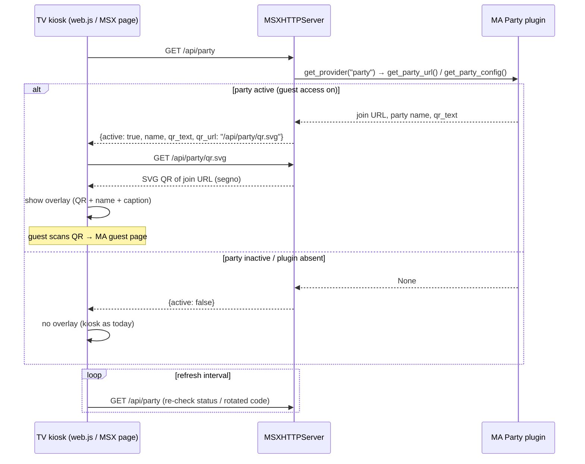

## Problem Statement

Music Assistant's Party plugin gives guests a join URL (rendered as a QR
code in the MA frontend) to add, boost and skip songs. The MSX bridge
kiosk already shows album art, the queue and karaoke lyrics on the TV —
but not the party QR code, so guests have no way to join from the
largest screen in the room. Requested in issue #65 (two forms: display
only, and display + TV audio) and echoed in the MA community discussion
music-assistant#5631, where the bridge is recommended for exactly this
use case except for the missing QR.

## Solution Summary

When the Party plugin is loaded and guest access is enabled, the kiosk
overlays a QR code of the guest join URL together with the party name
and the configured QR caption. The bridge exposes a small party-status
endpoint plus a server-rendered QR image (SVG, generated with the
pure-Python `segno` package declared in `manifest.json` requirements)
so both the browser kiosk and the native MSX pages on the TV can show
it without client-side QR generation or CDN access. Both requested
forms already exist as kiosk variants: display-only (`?kiosk=1` without
audio target) and display + TV audio (kiosk HTML5 mode) — the overlay
appears in both. When the Party plugin is absent, disabled, or guest
access is off, the endpoints return an empty status and the kiosk
renders exactly as today.

## Acceptance Criteria

1. With the Party plugin enabled and guest access on, the kiosk shows a scannable QR code that opens the guest join URL, plus the party name and QR caption from the party config.
2. Scanning the QR from a phone on the same network opens the MA guest page; with MA remote access enabled the QR encodes the remote join URL instead.
3. With the Party plugin missing, disabled, or guest access off, the kiosk renders with no QR overlay and no errors, and the party endpoints return an empty status (nothing about the join URL leaks).
4. The QR overlay updates without a page reload when guest access is toggled or the join code is re-issued (polling or WS push), within one refresh interval.
5. The QR image endpoint returns a valid SVG for the current join URL and 404s when no party is active.
6. A native MSX content page on the TV can display the same QR image via its URL.
7. Display-only and display+audio kiosk variants both show the overlay; audio playback behaviour is unchanged.
8. The provider imports, lints and type-checks with `segno` declared in `manifest.json` requirements (no hard import when the Party plugin is unused).

## Test Plan

- Unit tests for the party-status endpoint: plugin present + guest access on (URL, name, caption returned), plugin present + guest access off (empty), plugin absent (empty) — party provider mocked via `mass_mock.get_provider`.
- Unit test for the QR endpoint: returns `image/svg+xml` containing a QR for the join URL; 404 when no active party.
- Content test for the MSX party page item referencing the QR image URL.
- Regression: existing kiosk tests unchanged; web player loads with party endpoints returning empty status.
- Manual: real MA with Party plugin — scan QR from a phone, add a song as guest, toggle guest access and watch the overlay appear/disappear on the TV.

## Sequence Diagram

