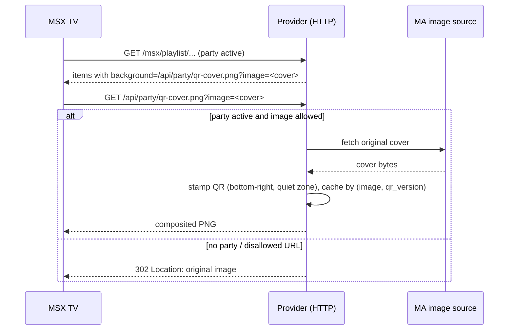

## Problem Statement

Two rough edges in how the party join QR reaches guests' eyes:

1. In the web kiosk the QR overlay sits in the top-left corner, visually
   colliding with the edge of the artwork and looking off-balance on large
   TV screens.
2. In native MSX playback there is no way to see the QR at all while music
   plays: the MSX player shows only the track's cover art as background,
   and MSX cannot render overlays — a guest has to leave playback and open
   the Party menu page to scan.

## Solution Summary

The kiosk overlay moves to the top center of the screen. For native MSX
playback the provider gains a small server-side compositor: when a party is
active, cover-art backgrounds handed to the MSX player are rewritten to a
new endpoint that stamps the party QR (with a white quiet zone) into the
bottom-right corner of the original cover image, so the QR is visible on
the TV during playback without any MSX-side rendering support.

## Acceptance Criteria

1. The kiosk party overlay is horizontally centered at the top of the
   screen in both kiosk variants; nothing else about the overlay changes.
2. A new endpoint returns the given cover image with the party QR
   composited into its bottom-right corner as PNG; the QR keeps a white
   quiet zone and scales with the cover size.
3. When no party is active, the endpoint redirects to the original image —
   stale playlist JSON cached by TVs keeps working after the party ends.
4. Only images served by the provider or Music Assistant itself are
   composited; the endpoint refuses to proxy arbitrary third-party URLs
   (redirects to the original instead).
5. While a party is active, track backgrounds in MSX playlists and the
   WebSocket "play" background use the composited URL; with no party
   active the original URLs are used unchanged.
6. Composited images are cached per (image, join-code version) so QR
   rotation invalidates them and repeated views do not re-fetch/re-encode.

## Test Plan

- Unit: the compositor function stamps a QR onto a source image (output
  differs from source, dimensions preserved, corner pixels white-ish).
- Integration: `GET /api/party/qr-cover.png?image=...` with an active
  party returns `image/png`; without a party returns 302 to the original.
- Integration: a disallowed (external-host) image URL is redirected, not
  fetched.
- Unit: playlist mapping uses the composited URL when a party is active
  and the original URL when not.
- Unit: `broadcast_play` rewrites `image_url` only while the cached party
  state is active.
- Manual: play an album on a real TV with a party active — cover shows the
  QR bottom-right and it scans; stop the party — next track shows a clean
  cover.

## Sequence Diagram

