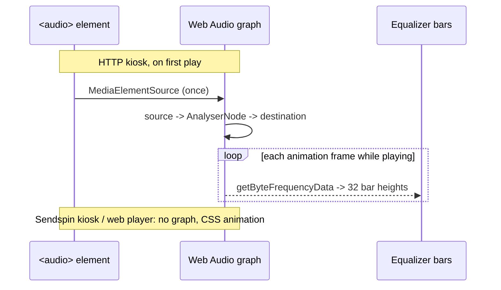

## Problem Statement

The kiosk's center equalizer (shown when a track has no lyrics) is a purely
decorative CSS animation — its 32 bars bounce on random timers unrelated to
the music. It looks alive but reacts to nothing.

## Solution Summary

In the HTTP kiosk (`?kiosk=1` without `sendspin=1`) the equalizer becomes a
real spectrum analyzer: the existing `<audio>` element is routed through a
Web Audio `AnalyserNode`, and the 32 existing bars are driven from live FFT
magnitudes each animation frame. The Sendspin kiosk is untouched (its audio
is owned by the Sendspin SDK, which exposes no audio graph) and keeps the
decorative CSS animation. Any failure to set up Web Audio (unsupported
engine, tainted stream) degrades silently to the existing CSS animation.

## Acceptance Criteria

1. In HTTP kiosk mode the equalizer bar heights are driven by the live
   audio spectrum (FFT), not the CSS keyframe animation.
2. The Sendspin kiosk and the non-kiosk web player are unchanged — no
   AnalyserNode is attached and the decorative animation remains.
3. Audio keeps playing: routing through the analyzer must still reach the
   output (analyzer is not a dead end).
4. Setup is guarded: the `MediaElementSource` is created at most once per
   audio element, and any Web Audio error falls back to the CSS animation
   without breaking playback.
5. The analyzer is (re)started on play/resume and does not require a page
   reload between tracks.

## Test Plan

- Node smoke test: `web.js` parses without syntax errors (headless, no DOM).
- Manual (browser): open `/web?kiosk=1`, play a track with no lyrics —
  bars track the beat; pause freezes them; a silent passage flattens them.
- Manual: open `/web?kiosk=1&sendspin=1` — decorative animation only, audio
  still synchronized; no console errors.
- Manual: open `/web` (non-kiosk) — unchanged.

## Sequence Diagram

