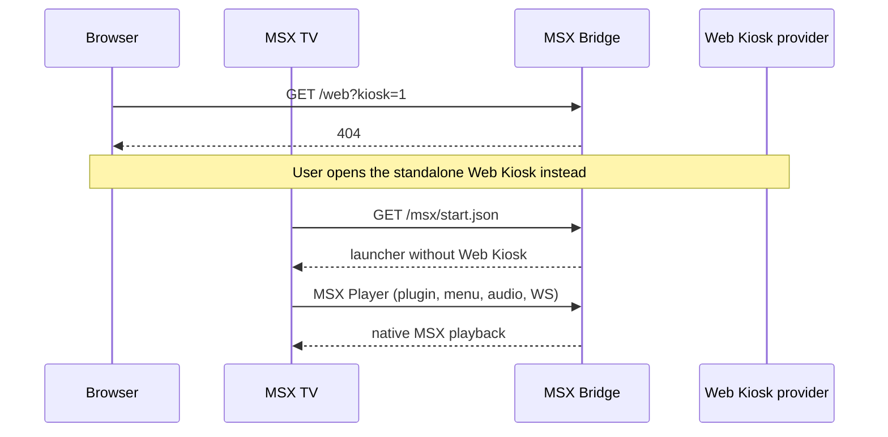

## Problem Statement

MSX Bridge ships a browser web player and kiosk at `/web` (library UI,
karaoke, visualizer, Sendspin kiosk) plus a Sendspin bridge that opens
that kiosk on the TV. The kiosk is moving to a standalone Web Kiosk
provider. Leaving a second copy here splits maintenance and confuses
which app owns always-on displays.

## Solution Summary

This provider serves Media Station X only. `/web`, the kiosk URL builder,
the launcher "Web Kiosk" item, the Sendspin-bridge config, and the lyrics
and queue JSON APIs that existed for the kiosk are removed. TVs keep the
native MSX menu, playlists, audio, WebSocket, grouping, and Party QR on
MSX pages. Browser kiosk users switch to the standalone Web Kiosk
provider.

## Acceptance Criteria

1. `GET /web`, `GET /web/`, and static files under `/web/` return 404.
2. The status dashboard (`GET /`) has no Web Player, kiosk, or Sendspin
   kiosk links and no kiosk URL builder.
3. The MSX launcher has no "Web Kiosk" item; start.json still boots the
   MSX player flow.
4. Provider config has no `enable_sendspin_bridge` entry; registering a
   TV does not open a kiosk URL.
5. `GET /api/lyrics/{player_id}` and `GET /api/queue/{player_id}` return
   404. Party QR endpoints used by native MSX pages still work.
6. The MSX interaction plugin no longer handles a `sendspin` WebSocket
   message that navigates to `/web`.

## Test Plan

- `test_removed_kiosk_and_sendspin_routes_404` includes `/web` paths.
- Root HTML tests assert kiosk-builder and `/web?` links are absent.
- Launcher JSON contains MSX Player and does not contain Web Kiosk.
- `get_config_entries` has no `enable_sendspin_bridge`.
- Lyrics and queue JSON routes 404.
- `plugin.html` has no `msg.type === "sendspin"` kiosk navigation.
- Existing MSX bootstrap, playlist, audio, Party, and grouping tests stay
  green.

## Sequence Diagram

