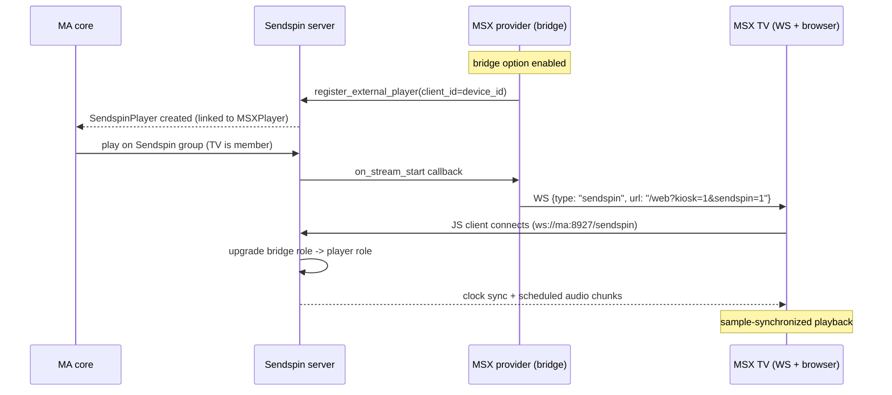

## Problem Statement

MSX TVs cannot take part in Music Assistant's synchronized multi-room
playback. Grouping today only works between MSX TVs themselves, and even
then the "Shared Buffer" mode merely feeds all TVs from one encoder — the
TVs still start and drift independently, and a TV can never be grouped with
a Sendspin speaker, an AirPlay device or the MA web player. Meanwhile MA has
made Sendspin its native playback protocol and ships a reusable bridge
framework that AirPlay, Chromecast and local audio already use to join
foreign-protocol players into sample-accurate Sendspin groups.

## Solution Summary

Each MSX TV gets an optional Sendspin bridge, following the Chromecast
receiver model: the provider registers the TV as an external Sendspin client
(so it appears as a Sendspin-capable player linked to the MSX player), and
when a synchronized stream starts, the provider tells the TV — over the
already-established WebSocket — to open the kiosk web player in Sendspin
mode. The kiosk's vendored Sendspin JS client connects to the Sendspin
server, the server upgrades the client from the bridge role to a real player
role, and the TV plays sample-synchronized audio together with any other MA
players. TVs whose browser cannot run the JS client keep using the existing
HTTP streaming path; the bridge is opt-in per provider config.

## Acceptance Criteria

1. With the bridge enabled, each registered MSX TV appears in MA as a
   Sendspin-capable player linked to (not duplicating) the MSX player.
2. An MSX TV can be added to a Sendspin sync group together with non-MSX
   players (e.g. the MA web player), and group playback on the TV is
   time-synchronized by the Sendspin server, not by HTTP timing.
3. Starting synchronized playback pushes the TV into Sendspin kiosk mode
   automatically via the existing WebSocket channel — no manual navigation
   on the TV.
4. The Sendspin JS client on the TV is served from the provider itself
   (vendored copy); no internet/CDN access is required on the TV.
5. Disabling the bridge option (default: off) leaves current behavior
   untouched: players register as today and stream over HTTP.
6. When the TV's browser fails to start the Sendspin client (old engine,
   no WebAudio), playback falls back to the HTTP path and the failure is
   visible in the provider log — the TV is not left silent.
7. Removing/idle-unregistering an MSX player also removes its bridge
   client from the Sendspin server (no orphaned clients).

## Test Plan

- Unit: bridge manager registers an external Sendspin client per MSX player
  when the option is enabled, and none when disabled.
- Unit: unregistering an MSX player (user removal and idle timeout) removes
  the bridge client.
- Unit: the stream-start callback sends the expected WebSocket message
  (open Sendspin kiosk) to the TV's WS clients.
- Integration: with a mocked Sendspin server API, enabling the option on a
  provider with two registered TVs yields two bridge registrations with
  stable client ids derived from the device ids.
- Integration: WS message flow — bridge stream start followed by client
  connect upgrades without sending the legacy HTTP `play` message.
- Manual: two real TVs + MA web player in one Sendspin group; verify
  audible sync; verify fallback on a TV with an old browser engine.

## Sequence Diagram

## Data Model

- **Bridge client id**: `msx-bridge-<sanitized device_id>` — stable across
  reconnects so the Sendspin player identity (and its config) persists.
- **Provider config**: new boolean entry `enable_sendspin_bridge`
  (default `false`), independent of `enable_player_grouping`.
- **WS message (MA -> TV)**: new type `sendspin`
  `{ "type": "sendspin", "url": "<kiosk url with sendspin params>" }` —
  instructs the interaction plugin to open the Sendspin kiosk.
- **Bridge registry**: provider-held map `player_id -> bridge handle`
  (client id, sendspin client ref, stream-start unsubscribe), torn down on
  player unregister and provider unload.
- **No changes** to `MSXPlayer` persisted state; the Sendspin-side player is
  owned by the Sendspin provider via the bridge framework.
